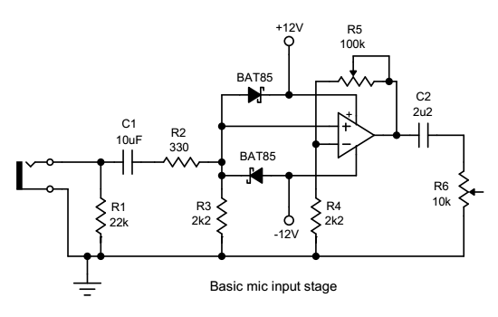
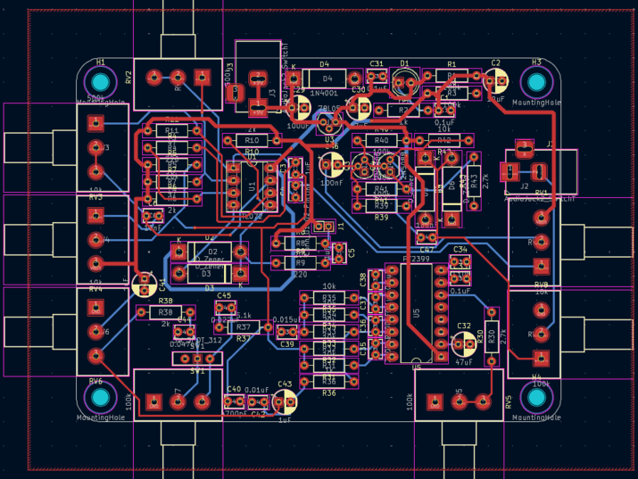
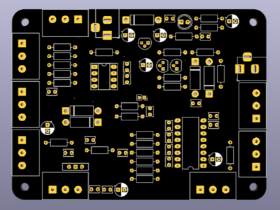
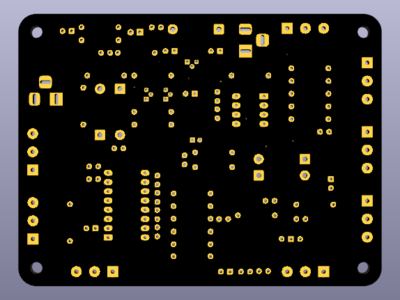

# caja-galletas

> *Caja de ruido en proceso*
>
> *Todas las versiones de KiCad están en sus carpetas propias*

-------------------

- ### Features

> *La idea es tener esta PCB en una caja de galletas*
> 
> *La placa en sí ya tiene efectos integrados como reverb y un Muff Fuzz*
> 
> *La caja se conecta a un parlante o pc con Jack 3.5mm*
> 
> *Y como alimentación también tiene un Jack 3.5mm*
> 

  - Dentro de la caja hay:
    - Regulador de voltaje **``(9V -----> 5V)``**
      - VBUS
    - Reverb **``(PT2399)``**
      - *Switch para tener feedback*
    - Pre-Amp / Amp **``(TL072)``**
    - Muff Fuzz **``(2N5088)``**
   

-  ## v2

- ### esquematico v2

-  

-  El esqumatico del PT2399 es el "Boy in Well" con un mod de DIY Guitar Pedals:
    - https://youtu.be/9sHnaUfTWug?si=lqVHKw3zSinBoRW7&t=106 (1:46 - 4:46)
    - Muestra que cortando la conexión de un potenciómetro (RV7) con un switch y bajando el valor de una resistencia (R37), permite que la señal no se filtre (y no pierda info) para que llegue de vuelta al PT2399 haciendo repeats infinitos
      - https://www.diyguitarpedals.com.au/shop/boms/Boy%20in%20Well.pdf (Esquematico original sin switch) (Pagina 30)
    - En KiCad al hacer el ERC no me arroja errores
      - Solo 2 avisos de simbolos que modifiqué para hacer más facil el esquematico
      - En la PBC tampoco me muestra errores de conexión
        - Si quiero cambiar el tamaño y orden de la placa
          - Más rectangular y ahorrar espacio
         
- 
- El Amp que tomé de referencia, es el mismo que el de [maincra](https://github.com/disenoUDP/dis8644-2026-1-procesos-2/tree/main/00-proyecto-02/grupo-01)
  - Con los cambios para hacer más sensible el piezo (R4 y R5)
  - Eso sí, ahora usando ambos OP-Amps
 
- El efecto "Muff Fuzz" lo saqué de esta pagina:
  - https://beavisaudio.com/beavisboard/projects/bbp_MuffFuzz.pdf
 
-------------------

- ### pcb v2

- 
  - Tengo que arreglar las vías *(?)*
    - Sin querer use el tamaño predeterminado, no se si eso vaya a ser un problema
  - La huella de los 2N5088 y 78L05 tienen uno externo a la biblioteca de KiCad
    - Los cambié por uno de la biblioteca default en el v3
      - Además de corregir un alivio termico que no nombraban en los errores pero si era preocupante
- 
  - Hay espacio vacío que me permite re-ordenar los componentes y achicar el tamaño de la PCB
 
-------------------
 
- ## v3

- Arreglos minimos de huellas para que sea más facil de compartir

-------------------

- ## v4

- ### esquematico v4
  - igual que v2 pero con Jack 3.5mm a cambio del Terminal Block
 
-------------------
 
- ### pcb v4

- 
  - Cambié las vías al tamaño que nos recomendaros en taller
    - Optimicé la posición de los componentes para usar el espacio vacío
  - Añadí Mounting Holes M3
  - Al ver los errores solo mostraba problemas de la serigrafía
    - Nada con alivios termicos
- 
- 
