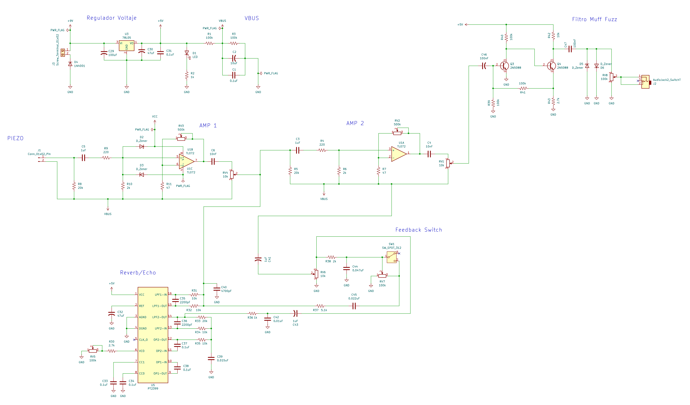
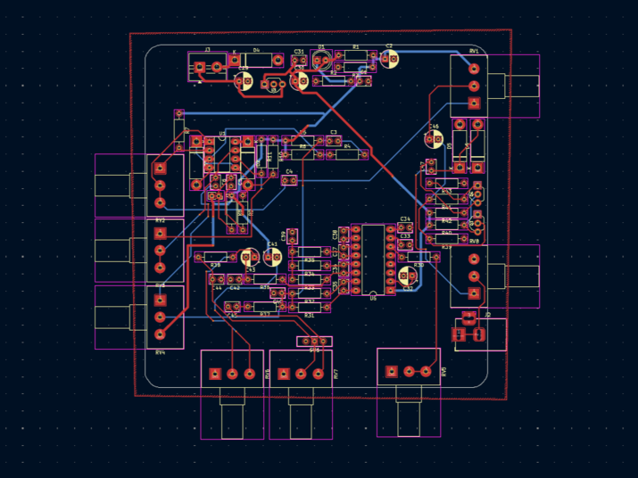
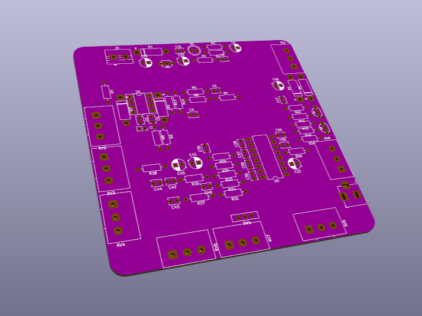

# caja-galletas

> *Caja de ruido en proceso*
>
> *Todas las versiones de KiCad están en carpetas*

-------------------

- ### Features

> *La idea es tener esta PCB en una caja de galletas*
> 
> *La caja se conecta a un parlante o pc con Jack 3.5mm*

  - Dentro de la caja hay:
    - Regulador de voltaje **``(9V -----> 5V)``**
      - VBUS
    - Reverb **``(PT2399)``**
      - Switch para tener feedback
    - Pre-Amp / Amp **``(TL072)``**
    - Muff Fuzz **``(2N5088)``**
   

-  ## v2

-  

-  El esqumatico del PT2399 es el "Boy in Well" con un mod de DIY Guitar Pedals:
    - https://youtu.be/9sHnaUfTWug?si=lqVHKw3zSinBoRW7&t=106 (1:46 - 4:46)
    - Muestra que cortando la conexión de un potenciómetro (RV7) con un switch y bajando el valor de una resistencia (R37), permite que la señal no se filtre (y no pierda info) para que llegue de vuelta al PT2399 haciendo repeats infinitos
      - https://www.diyguitarpedals.com.au/shop/boms/Boy%20in%20Well.pdf (Esquematico original sin switch) (Pagina 30)
    - En KiCad al hacer el ERC no me arroja errores
      - Solo 2 avisos de simbolos que modifiqué para hacer más facil el esquematico
      - En la PBC tampoco me muestra errores de conexión
        - Si quiero cambiar el tamaño y orden de la placa
          - Más rectangular y ahorrar espacio

- 
  - Tengo que arreglar las vías
    - Sin querer use el tamaño predeterminado
- 
  - Hay espacio vacío que me permite re-ordenar los componentes y achicar el tamaño de la PCB
